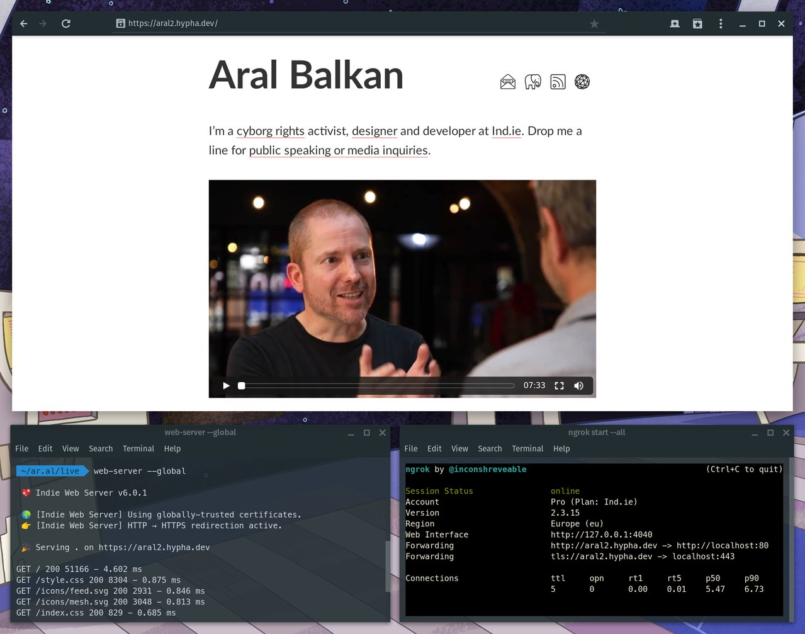
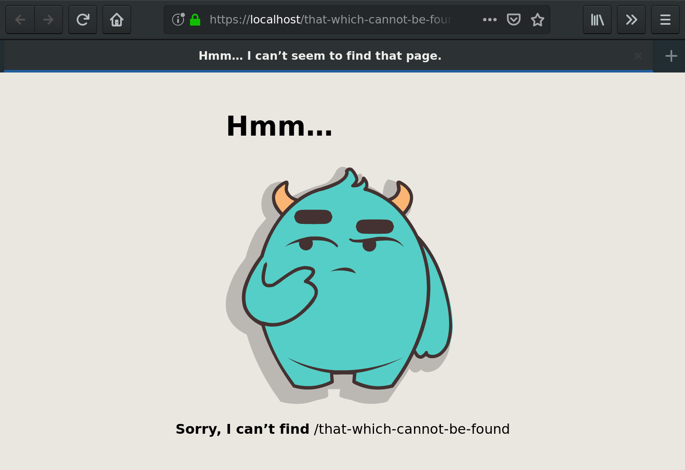

# Indie Web Server



Indie Web Server is a secure and seamless [Small Tech](https://ar.al/2019/03/04/small-technology/) personal web server.

  - Zero-configuration – It Just Works 🤞™.

  - Develop and test with automatically-provisioned locally-trusted TLS thanks to [mkcert](https://github.com/FiloSottile/mkcert) via [Nodecert](https://source.ind.ie/hypha/tools/nodecert).

  - Stage and deploy with automatically-provisioned globally-trusted TLS thanks to [Let’s Encrypt](https://letsencrypt.org/) via [ACME TLS](https://source.ind.ie/hypha/tools/acme-tls) (with an A score on [SSL Labs SSL Server Test](https://www.ssllabs.com/ssltest)) and the seamlessly-integrated [pm2](https://pm2.io/runtime/) process manager.

[Watch a short 4-minute video](https://ar.al/2019/03/14/introducing-indie-web-server-video/) demonstrating how easy Indie Web Server is to install and use.

(Note: the video is about two weeks old and so it does not demonstrate the new `--live` feature for seamless deployments or the native binary distributions. I will record a new one as soon as I find some time.)

## Install

Copy and paste the following commands into your terminal:

### Linux

```
wget https://ind.ie/web-server/linux/7.2.0.zip && unzip 7.2.0.zip && chmod +x web-server && sudo mv web-server /usr/local/bin/
```

### macOS

```
wget https://ind.ie/web-server/macos/7.2.0.zip && unzip 7.2.0.zip && chmod +x web-server && sudo mv web-server /usr/local/bin/
```

### Node.js

```sh
npm i -g @ind.ie/web-server
```

## Use

### Development

Start serving the current directory at https://localhost using locally-trusted certificates:

```shell
$ web-server
```

### Staging

Start serving the _site_ directory at your _hostname_ as a regular process using globally-trusted Let’s Encrypt certificates:

```shell
$ web-server --staging site
```

For example, use [ngrok](https://ngrok.com/) (Pro+) with a custom domain name that you set in your `hostname` file (e.g., in `/etc/hostname` or via `hostnamectl set-hostname <hostname>` or the equivalent for your platform). The first time you hit your staging server via your hosname it will take a little longer to load as your Let’s Encrypt certificates are being automatically provisioned by ACME TLS.

### Live

Start serving the _site_ directory at your _hostname_ as a daemon that is automatically run at system startup and restarted if it crashes:

```shell
$ web-server --live site
```

The `--live` option sets up your server to (re)start automatically when your server (re)starts and/or crashes, etc. Requires superuser privileges on first run to set up the launch item.

For example, if you run the command on a connected server that has the ar.al domain pointing to it and `ar.al` set in _/etc/hostname_ (on Unix/Linux/macOS), you will be able to access the site at https://ar.al. The first time you hit it, it will take a little longer to load as your Let’s Encrypt certificates are being automatically provisioned by ACME TLS.

With a running live server, you can also use the following commands:

  - `--monitor`: Monitor the server.
  - `--logs`: Display and tail the server logs.
  - `--info`: Display detailed information about the server.
  - `--offline`: Take the server offline and remove it from startup items.

The live server uses the [pm2](https://pm2.io/runtime/) process manager internally. Beyond the commands listed above that Indie Web Server supports natively (and proxies to pm2), you can make use of all pm2 functionality via the pm2 command directly should you need to.

## Build and test from source

### Global Node.js module

```shell
# Clone and install.
git clone https://source.ind.ie/hypha/tools/web-server.git
cd web-server
npm i         # Install modules and development dependencies.
npm i -g .    # Install globally for access to the binary.

# Run unit tests.
npm test

# Serve the test site (visit https://localhost to view).
web-server test/site
```

### Native binaries

```shell
# Clone and install.
git clone https://source.ind.ie/hypha/tools/web-server.git
cd web-server
npm i         # Install modules and development dependencies.

# Run unit tests.
npm test

# Build the native binaries
npm run build

# Serve the test site (visit https://localhost to view).
# e.g., To run the version 7.2.0 Linux binary:
dist/linux/7.2.0/web-server test/site
```

## Syntax

```shell
web-server [folder-to-serve] [options]
```

  * __folder-to-serve:__ Path to the folder to serve (defaults to current folder).

### Options:

  * __--port=N:__ The port to start the server on (defaults to 443).
  * __--version:__ Display the version and exit.

  * __--staging:__ Launch server as regular process with globally-trusted certificates.

  * __--live:__ Launch server as startup daemon with globally-trusted certificates.

### With a running live server, you can also:

  * __--monitor:__ Monitor the server.

  * __--logs:__ Display and tail the server logs.

  * __--info:__ Display detailed information about the server.

  * __--offline:__ Take the server offline and remove it from startup items.


All command-line arguments are optional. By default, Indie Web Server will serve your current working folder over port 433 with locally-trusted certificates.

If you launch with the `--staging` or `--global` options, globally-trusted Let’s Encrypt TLS certificates are automatically provisioned for you using ACME TLS the first time you hit your hostname. The hostname for the certificates is automatically set from the hostname of your system (and the _www._ subdomain is also automatically provisioned).

## Native 404 → 302 support for an evergreen web

What if links never died? What if we never broke the Web? What if it didn’t involve any extra work? It’s possible. And easy. Just make your 404s into 302s.

Indie Web Server has native support for [the 404 to 302 technique](https://4042302.org) to ensure an evergreen web. Just serve the old version of your site (e.g., your WordPress site, etc.) from a different subdomain and tell Indie Web Server to forward any unknown requests on your new static site to that subdomain so that all your existing links magically work.

To do so, create a simple file called `4042302` in the root directory of your web content and add the URL of the server that is hosting your older content. e.g.,

### /4042302
```
https://the-previous-version-of.my.site
```

You can chain the 404 → 302 method any number of times to ensure that none of your links ever break without expending any additional effort to migrate your content.

For more information and examples, see [4042302.org](https://4042302.org).

## Custom error pages



You can specify a custom error page for 404 (not found) and 500 (internal server error) errors. To do so, create a folder with the status code you want off of the root of your web content (i.e., `/404` and/or `/500`) and place at least an `index.html` file in the folder. You can also, optionally, put any assets you want to display on your error pages into those folders and load them in via relative URLs. Your custom error pages will be served with the proper error code and at the URL that was being accessed.

If you do not create custom error pages, the built-in default error pages will be displayed for 404 and 500 errors.

When creating your own servers (see [API](#API)), you can generate the default error pages programmatically using the static methods `WebServer.default404ErrorPage()` and `WebServer.default500ErrorPage()`, passing in the missing path and the error message as the argument, respectively to get the HTML string of the error page returned.

## API

Indie Web Server’s `createServer` method behaves like the built-in _https_ module’s `createServer` function. Anywhere you use `require('https').createServer`, you can simply replace it with `require('@ind.ie/web-server').createServer`.


### createServer([options], [requestListener])

  - __options__ _(object)___:__ see [https.createServer](https://nodejs.org/api/https.html#https_https_createserver_options_requestlistener). Populates the `cert` and `key` properties from the automatically-created [nodecert](https://source.ind.ie/hypha/tools/nodecert/) or Let’s Encrypt certificates and will overwrite them if they exist in the options object you pass in. If your options has `options.global = true` set, globally-trusted TLS certificates are obtained from Let’s Encrypt using ACME TLS.

  - __requestListener__ _(function)___:__ see [https.createServer](https://nodejs.org/api/https.html#https_https_createserver_options_requestlistener). If you don’t pass a request listener, Indie Web Server will use its default one.

    __Returns:__ [https.Server](https://nodejs.org/api/https.html#https_class_https_server) instance, configured with either locally-trusted certificates via nodecert or globally-trusted ones from Let’s Encrypt.

#### Example

```js
const webServer = require('@ind.ie/web-server')
const express = require('express')

const app = express()
app.use(express.static('.'))

const options = {} // to use globally-trusted certificates instead, set this to {global: true}
const server = webServer.createServer(options, app).listen(443, () => {
  console.log(` 🎉 Serving on https://localhost\n`)
})
```

### serve([options])

Options is an optional parameter object that may contain the following properties, all optional:

  - __path__ _(string)___:__ the directory to serve using [Express](http://expressjs.com/).static.

  - __callback__ _(function)___:__ a function to be called when the server is ready. If you do not specify a callback, you can specify the port as the second argument.

  - __port__ _(number)___:__ the port to serve on. Defaults to 443. (On Linux, privileges to bind to the port are automatically obtained for you.)

  - __global__ _(boolean)___:__ if true, globally-trusted Let’s Encrypt certificates will be provisioned (if necesary) and used via ACME TLS. If false (default), locally-trusted certificates will be provisioned (if necesary) and used using nodecert.

    __Returns:__ [https.Server](https://nodejs.org/api/https.html#https_class_https_server) instance, configured with either locally or globally-trusted certificates.


#### Examples

Serve the current directory at https://localhost using locally-trusted TLS certificates:

```js
const webServer = require('@ind.ie/web-server')
const server = webServer.serve()
```

Serve the current directory at your hostname using globally-trusted Let’s Encrypt TLS certificates:

```js
const webServer = require('@ind.ie/web-server')
const server = webServer.serve({global: true})
```

## Contributing

Indie Web Server is, by design, a zero-configuration personal web server for single-tenant web applications for and by individuals. As such, any new feature requests will have to be both fit for purpose and survive a trial by fire to be considered. (That is, this is [Small Tech](https://ar.al/2019/03/04/small-technology/), with the emphasis on _small_).

Please file issues and submit pull requests on the [Indie Web Server Github Mirror](https://github.com/indie-mirror/indie-web-server).

## Help wanted

For locally-trusted certificates, all dependencies are installed automatically for you if they do not exist if you have apt, pacman, or yum (untested) on Linux or if you have [Homebrew](https://brew.sh/) or [MacPorts](https://www.macports.org/) (untested) on macOS.

I can use your help to test Indie Web Server on the following platform/package manager combinations:

  - Linux with yum
  - macOS with MacPorts

Please [let me know how/if it works](https://github.com/indie-mirror/web-server/issues). Thank you!

Also, automatic hostname detection has not been implemented for Windows and so globally-trusted certificates will fail on that platform. If you get to it before I do, [I would appreciate a pull request](https://github.com/indie-mirror/web-server/pulls).


## Thanks

  * [thagoat](https://github.com/thagoat) for confirming that [installation works on Arch Linux with Pacman](https://github.com/indie-mirror/https-server/issues/1).

  * [Tim Knip](https://github.com/timknip) for confirming that [the module works with 64-bit Windows](https://github.com/indie-mirror/https-server/issues/2) with the following behaviour: “Install pops up a windows dialog to allow adding the cert.”

  * [Run Rabbit Run](https://hackers.town/@nobody) for [the following information](https://hackers.town/@nobody/101670447262172957) on 64-bit Windows: “Win64: works with the windows cert install popup on server launch. Chrome and ie are ok with the site then. FF 65 still throws the cert warning even after restarting.”
