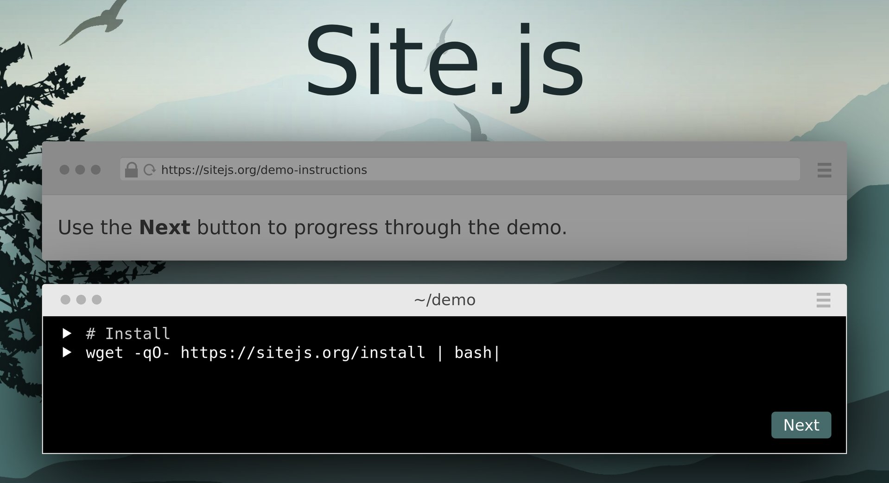

# Site.js

[](https://sitejs.org)

## Develop, test, and deploy your secure static or dynamic personal web site with zero configuration.

__Site.js is an integrated [Small Tech](https://ar.al/2019/03/04/small-technology/) personal web tool for Linux and Linux-like* operating systems.__

  - Zero-configuration – It Just Works 🤞™.

  - Develop with automatically-provisioned locally-trusted TLS courtesy of [mkcert](https://github.com/FiloSottile/mkcert) seamlessly integrated via [Nodecert](https://source.ind.ie/hypha/tools/nodecert).

  - Stage and deploy production servers with automatically-provisioned globally-trusted TLS courtesy of [Let’s Encrypt](https://letsencrypt.org/) seamlessly integrated via [ACME TLS](https://source.ind.ie/hypha/tools/acme-tls) and [systemd](https://freedesktop.org/wiki/Software/systemd/). Your server will score an A on the [SSL Labs SSL Server Test](https://www.ssllabs.com/ssltest).

  - Create static web sites, extend them with dynamic JavaScript routes, or extend Site.js in Node.js to create fully-dynamic personal web applications.

  <ins>Note:</ins> Live deployments via startup daemons are only supported on Linux distributions with systemd.

  \* Works with Linux, macOS, and Windows Subsystem for Linux.

## Install

Copy and paste the following commands into your terminal:

### Native binaries

__Before you pipe any script into your computer, always [view the source code](https://site.js/install) and make sure you understand what it does.__

```shell
wget -qO- https://sitejs.org/install | bash
```

### Node.js

```shell
npm i -g @small-tech/site.js
```

## Uninstall

To uninstall the native binary (and any created artifacts, like TLS certificates, systemd services, etc.):

```shell
site uninstall
```

## Use

### Local

Start serving the current directory at https://localhost as a regular process using locally-trusted certificates:

```shell
$ site
```

### Proxy server (local)

You can use Site.js as a development-time reverse proxy for HTTP and WebSocket connections. For example, if you use [Hugo](https://gohugo.io/) and you’re running `hugo server` on the default HTTP port 1313. You can run a HTTPS reverse proxy at https://localhost [with LiveReload support](https://source.ind.ie/hypha/tools/web-server/blob/master/bin/web-server.js#L237) using:

```shell
$ site proxy localhost:1313
```

This will create and serve the following proxies:

  * http://localhost:1313 → https://localhost
  * ws://localhost:1313 → wss://localhost

### Live sync to remote server

Part of local development involves deploying your changes to a live server at some point. You can use Site.js to handle this for you in real-time:

```shell
$ site sync my-demo my-demo.site
```

The above command will start a local development server at _https://localhost_. Additionally, it will watch the folder _my-demo_ for changes and sync any changes to its contents via rsync over ssh to _my-demo.site_. Without any customisations, the sync command assumes that your account on your remote server has the same name as your account on your local machine and that the folder you are watching (_my-demo_, in the example above) is located at _/home/your-account/my-demo_. Also, by default, the contents of the folder will be synced, not the folder itself. You can change these defaults using optional arguments.

```shell
$ site sync my-folder --host=my-demo.site --account=a-different-account --folder=not-my-folder
```

e.g., The above command will watch the the contents of the _my-folder_ directory and sync it to _a-different-account@my-demo.site:/home/a-different-account/not-my-folder_.

You can also customise the destination folder completely but supplying a custom remote connection string using the `--to` option:

```shell
$ site sync my-folder --to=some-account@my-demo.site:/var/www
```

Like the other commands, if you do not specify a folder, the current folder will be used by default.

If you want to sync not the folder’s contents but the folder itself, use the `--sync-folder-and-contents` flag. e.g.,

```shell
$ site sync my-local-folder my.site --account=me --folder=my-remote-folder --sync-folder-and-contents
```

The above command will result in the following directory structure on the remote server: _/home/me/my-remote-folder/my-local-folder_

If you want to carry out a one-time sync and not continue to run the web server afterwards, use the `--exit-on-sync` flag. e.g.,

```shell
$ site sync my-folder my-demo.site --exit-on-sync
```

### Global (ephemeral)

Start serving the _my-site_ directory at your _hostname_ as a regular process using globally-trusted Let’s Encrypt certificates:

```shell
$ site global my-site
```

Then use, for example, [ngrok](https://ngrok.com/) (Pro+) to point a custom domain name to your temporary staging server. Make sure you set your `hostname` file (e.g., in `/etc/hostname` or via `hostnamectl set-hostname <hostname>` or the equivalent for your platform) to match your domain name. The first time you hit your server via your hostname it will take a little longer to load as your Let’s Encrypt certificates are being automatically provisioned by ACME TLS.

When you start your server using the `global` command, it will run as a regular process. It will not be restarted if it crashes or if you exit the foreground process or restart the computer.

### Global (persistent)

__Available on Linux distributions with systemd (most Linux distributions, but [not these ones](https://sysdfree.wordpress.com/2019/03/09/135/) or on macOS).__

Start serving the _my-site_ directory at your _hostname_ as a daemon that is automatically run at system startup and restarted if it crashes:

```shell
$ site enable my-site
```

The `enable` command sets up your server to start automatically when your server starts and restart automatically if it crashes. Requires superuser privileges on first run to set up the launch item.

For example, if you run the command on a connected server that has the ar.al domain pointing to it and `ar.al` set in _/etc/hostname_, you will be able to access the site at https://ar.al. The first time you hit it, it will take a little longer to load as your Let’s Encrypt certificates are being automatically provisioned by ACME TLS.

When the server is enabled, you can also use:

  - `disable`: Stop server and remove from startup.
  - `logs`: Display and tail server logs.
  - `status`: Display detailed server information (press ‘q’ to exit).

Site.js uses the [systemd](https://freedesktop.org/wiki/Software/systemd/) to start and manage the daemon. Beyond the commands listed above that Site.js supports natively (and proxies to systemd), you can make use of all systemd functionality via the `systemctl` and `journalctl` commands.

## Build and test from source

### Install the source and run tests

```shell
# Clone and install.
mkdir site.js && cd site.js
git clone https://source.ind.ie/site.js/app.git
cd app
./install

# Run unit tests.
npm test
```

### Install as global Node.js module

After you install the source and run tests:

```shell
# Install the binary as a global module
npm i -g

# Serve the test site locally (visit https://localhost to view).
site test/site
```

__Note:__ for commands that require root privileges (i.e., `enable` and `disable`), Site.js will automatically restart itself using sudo and Node must be available for the root account. If you’re using [nvm](https://github.com/creationix/nvm), you can enable this via:

```shell
# Replace v10.15.3 with the version of node you want to make available globally.
sudo ln -s "$NVM_DIR/versions/node/v10.15.3/bin/node" "/usr/local/bin/node"
sudo ln -s "$NVM_DIR/versions/node/v10.15.3/bin/npm" "/usr/local/bin/npm"
```

### Native binaries

After you install the source and run tests:

```shell
# Build the native binary for your platform.
# To build for all platforms, use npm run build -- --all
npm run build

# Serve the test site (visit https://localhost to view).
# e.g., To run the version 11.0.0 Linux binary:
dist/linux/11.0.0/web-server test/site
```

### Build and install native binary locally

After you install the source and run tests:

```shell
npm run install-locally
```

### Deployment

```shell
# To build binaries for both linux and macOS and also to
# copy them over to the Indie Web Site for deployment.
# (You will most likely not need to do this.)
npm run deploy
```

## Syntax

```shell
site [command] [folder|host] [host] [--options]
```

  * `command`: version | help | local | global | proxy | sync | enable | disable | logs | status
  * `folder|host`: Path of folder to serve (defaults to current folder) or host to proxy or sync.
  * `host`: Host to sync.
  * `options`: Settings that alter server characteristics.

### Commands:

  * `version`: Display version and exit.
  * `help`: Display help screen and exit.
  * `local`: Start server as regular process with locally-trusted certificates.
  * `global`: Start server as regular process with globally-trusted certificates.
  * `proxy`: Start server to proxy provided HTTP URL via HTTPS. Also proxies WebSockets.
  * `sync`: Start server as regular process with locally-trusted certificates and rsync folder to host.

On Linux distributions with systemd, you can also use:

  * `enable`: Start server as daemon with globally-trusted certificates and add to startup.
  * `disable`: Stop server daemon and remove from startup.
  * `logs`: Display and tail server logs.
  * `status`: Display detailed server information.

If `command` is omitted, behaviour defaults to `local`.

### Options:

  * `--port=N`: Port to start server on (defaults to 443).

#### For the enable command:

  * `--sync`: Ensure the server can also rsync via ssh (so you can sync your site to it from your local machine).

### For the sync command:

  * `--host`: The remote host to sync to (e.g., my-demo.site).
  * `--account`: The ssh account to use on remote server (defaults to same as on current session).
  * `--folder`:	The subfolder of home folder to sync to on remote machine (defaults to name of served folder).
  * `--proxy`: Proxy the specified host and port instead of starting a regular local server.
  * `--exit-on-sync`: Exit once the first sync has occurred. Useful in deployment scripts.
  * `--sync-folder-and-contents`: Sync folder and contents (default is to sync the folder’s contents only).

All command-line arguments are optional. By default, Site.js will serve your current working folder over port 443 with locally-trusted certificates.

If you want to serve a directory that has the same name as a command, you can specify the command in _options_ format. e.g., `site --enable logs` will start Site.js as a startup daemon to serve the _logs_ folder.

When you use the `global` or `enable` commands, globally-trusted Let’s Encrypt TLS certificates are automatically provisioned for you using ACME TLS the first time you hit your hostname. The hostname for the certificates is automatically set from the hostname of your system (and the _www._ subdomain is also automatically provisioned).

## Usage examples

### Develop using locally-trusted certificates:

| Goal                                      | Command                                                       |
| ----------------------------------------- | ------------------------------------------------------------- |
| Serve current folder (shorthand)          | site                                                          |
| Serve folder my-site (shorthand)          | site my-site                                                  |
| Serve current folder                      | site local                                                    |
| Serve folder my-site                      | site local my-site                                            |
| Serve folder my-site at port 666          | site local my-site --port=666                                 |
| Proxy localhost:1313 to https://localhost | site proxy localhost:1313                                     |
| Serve current folder, sync it to my.site  | site sync my.site                                             |
| Serve my-site folder, sync it to my.site  | site sync my-site my.site                                     |
| Ditto, but using the --host option        | site sync site --host=my.site                                 |
| Ditto, but use account me on my.site      | site sync site --host=my.site --account=me                    |
| Ditto, but sync to remote folder www      | site sync site --host=my.site --account=me --folder=www       |
| Ditto, but using the --to option          | site sync site --to=me@my.site:/home/me/www                   |
| Sync current folder, proxy localhost:1313 | site sync my.site --proxy=localhost:1313                      |

### Stage and deploy using globally-trusted Let’s Encrypt certificates:

| Goal                                      | Command                                                       |
| ----------------------------------------- | ------------------------------------------------------------- |
| Serve current folder                      | site global                                                   |
| Serve folder my-site                      | site global my-site                                           |
| Serve current folder as daemon            | site enable                                                   |
| Ditto & also ensure it can rsync via ssh  | site enable --sync                                            |
| Get status of daemon                      | site status                                                   |
| Display server logs                       | site logs                                                     |
| Stop current daemon                       | site disable                                                  |

## Native support for an Evergreen Web

What if links never died? What if we never broke the Web? What if it didn’t involve any extra work? It’s possible. And, with Site.js, it’s effortless.

### Native cascading archives support

If you have a static archive of the previous version of your site, you can have Site.js automatically serve it for you. For example, if your site is being served from the `my-site` folder, just put the archive of your site into a folder named `my-site-archive-1`:

```
|- my-site
|- my-site-archive-1
```

If a path cannot be found in `my-site`, it will be served from `my-site-archive-1`.

And you’re not limited to a single archive (and hence the “cascade” bit in the name of the feature). As you have multiple older versions of your site, just add them to new folders and increment the archive index in the name. e.g., `my-site-archive-2`, `my-site-archive-3`, etc.

Paths in `my-site` will override those in `my-site-archive-3` and those in `my-site-archive-3` will, similarly, override those in `my-site-archive-2` and so on.

What this means that your old links will never die but if you do replace them with never content in never versions, those will take precedence.

### Native 404 → 302 support

But what if the previous version of your site is a dynamic site and you either don’t want to lose the dynamic functionality or you simply cannot take a static backup. No worries. Just move it to a different subdomain or domain and make your 404s into 302s.

Site.js has native support for [the 404 to 302 technique](https://4042302.org) to ensure an evergreen web. Just serve the old version of your site (e.g., your WordPress site, etc.) from a different subdomain and tell Site.js to forward any unknown requests on your new static site to that subdomain so that all your existing links magically work.

To do so, create a simple file called `4042302` in the root directory of your web content and add the URL of the server that is hosting your older content. e.g.,

### /4042302
```
https://the-previous-version-of.my.site
```

You can chain the 404 → 302 method any number of times to ensure that none of your links ever break without expending any additional effort to migrate your content.

For more information and examples, see [4042302.org](https://4042302.org).

## Custom error pages


You can specify a custom error page for 404 (not found) and 500 (internal server error) errors. To do so, create a folder with the status code you want off of the root of your web content (i.e., `/404` and/or `/500`) and place at least an `index.html` file in the folder. You can also, optionally, put any assets you want to display on your error pages into those folders and load them in via relative URLs. Your custom error pages will be served with the proper error code and at the URL that was being accessed.

If you do not create custom error pages, the built-in default error pages will be displayed for 404 and 500 errors.

When creating your own servers (see [API](#API)), you can generate the default error pages programmatically using the static methods `WebServer.default404ErrorPage()` and `WebServer.default500ErrorPage()`, passing in the missing path and the error message as the argument, respectively to get the HTML string of the error page returned.

## Dynamic routes

You can include very basic dynamic routes by including JavaScript files that export middleware-style functions in a special _.dynamic_ folder in the root folder of your web content. The syntax and conventions are [detailed here](https://source.ind.ie/hypha/tools/web-routes-from-files).

So, for example, if you wanted to have a dynamic route that showed the server CPU load and free memory, you could create a file called _.dynamic/server-stats.js_ in your web folder with the following content:

```js
const os = require('os')

function serverStats (request, response, next) {

  const loadAverages = `<p> ${os.loadavg().reduce((a, c, i) => `${a}\n<li><strong>CPU ${i+1}:</strong> ${c}</li>`, '<ul>') + '</ul>'}</p>`

  const freeMemory = `<p>${os.freemem()} bytes</p>`

  const page = `<html><head><title>Server statistics</title><style>body {font-family: sans-serif;}</style></head><body><h1>Server statistics</h1><h2>Load averages</h2>${loadAverages}<h2>Free memory</h2>${freeMemory}</body></html>`

  response.end(page)
}

module.exports = serverStats
```

Site.js will load your dynamic route at startup and you can test it by hitting _https://localhost/server-stats_ using a local web server. Each time you refresh, you should get the latest dynamic content.

If you need to use custom Node modules, initialise your _.dynamic_ folder using `npm init` and use `npm install` as usual. And modules you require from your routes will be properly loaded and used.

### Directories

Your dynamic web routes are running within Site.js, which is a Node application compiled into a native binary.

  - `os.homedir()`: __(writable)__ This is the home folder of the account running Site.js. You can write to it to store persistent objects (e.g., save data).

  - `os.tmpdir()`: __(writable)__ Path to the system temporary folder. Use for content you can afford to lose and can recreate (e.g., cache API calls).

  - `.`: __(writable)__ Path to the root of your web content. Since you can write here, you can, if you want to, create content dynamically that will then automatically be served by the static web server.

  - `__dirname`: __(writeable)__ Path to the `.dynamic` folder.

  - `/`: __(read-only)__ Path to the `/usr` folder (Site.js is installed in `/usr/local/site`). You should not have any reason to use this.

If you want to access the directory of Site.js itself (e.g., to load in the `package.json` to read the app’s version), you can use the following code:

```js
const appPath = require.main.filename.replace('bin/site.js', '')
```

### Security

The code within your JavaScript routes is executed on the server. Exercise the same caution as you would when creating any Node.js app (sanitise input, etc.)

### Intended usage

You shouldn’t use this functionality to create your latest amazing web app. For that, include Site.js as a node module in your project and extend it that way. This is to add tiny bits of dynamic functionality. There is currently only support for `GET` routes. Again, if you need custom modules, extend Site.js using Node.js.

## API

Site.js’s `createServer` method behaves like the built-in _https_ module’s `createServer` function. Anywhere you use `require('https').createServer`, you can simply replace it with `require('@small-tech/site.js').createServer`.


### createServer([options], [requestListener])

  - __options__ _(object)_: see [https.createServer](https://nodejs.org/api/https.html#https_https_createserver_options_requestlistener). Populates the `cert` and `key` properties from the automatically-created [nodecert](https://source.ind.ie/hypha/tools/nodecert/) or Let’s Encrypt certificates and will overwrite them if they exist in the options object you pass in. If your options has `options.global = true` set, globally-trusted TLS certificates are obtained from Let’s Encrypt using ACME TLS.

  - __requestListener__ _(function)_: see [https.createServer](https://nodejs.org/api/https.html#https_https_createserver_options_requestlistener). If you don’t pass a request listener, Site.js will use its default one.

    __Returns:__ [https.Server](https://nodejs.org/api/https.html#https_class_https_server) instance, configured with either locally-trusted certificates via nodecert or globally-trusted ones from Let’s Encrypt.

#### Example

```js
const site = require('@small-tech/site.js')
const express = require('express')

const app = express()
app.use(express.static('.'))

const options = {} // to use globally-trusted certificates instead, set this to {global: true}
const server = site.createServer(options, app).listen(443, () => {
  console.log(` 🎉 Serving on https://localhost\n`)
})
```

### serve([options])

Options is an optional parameter object that may contain the following properties, all optional:

  - __path__ _(string)_: the directory to serve using [Express](http://expressjs.com/).static.

  - __callback__ _(function)_: a function to be called when the server is ready. If you do not specify a callback, you can specify the port as the second argument.

  - __port__ _(number)_: the port to serve on. Defaults to 443. (On Linux, privileges to bind to the port are automatically obtained for you.)

  - __global__ _(boolean)_: if true, globally-trusted Let’s Encrypt certificates will be provisioned (if necessary) and used via ACME TLS. If false (default), locally-trusted certificates will be provisioned (if necessary) and used using _nodecert_.

    __Returns:__ [https.Server](https://nodejs.org/api/https.html#https_class_https_server) instance, configured with either locally or globally-trusted certificates.


#### Examples

Serve the current directory at https://localhost using locally-trusted TLS certificates:

```js
const site = require('@small-tech/site.js')
const server = site.serve()
```

Serve the current directory at your hostname using globally-trusted Let’s Encrypt TLS certificates:

```js
const site = require('@small-tech/site.js')
const server = site.serve({global: true})
```

## Contributing

Site.js is [Small Technology](https://ar.al/2019/03/04/small-technology/). The emphasis is on _small_. It is, by design, a zero-configuration tool for creating and hosting single-tenant web applications. It is for humans, by humans. It is non-commercial. (It is not for enterprises, it is not for “startups”, and it is definitely not for unicorns.) As such, any new feature requests will have to be both fit for purpose and survive a trial by fire to be considered.

Please file issues and submit pull requests on the [Site.js Github Mirror](https://github.com/small-tech/site.js).

## Help wanted

For locally-trusted certificates, all dependencies are installed automatically for you if they do not exist if you have apt, pacman, or yum (untested) on Linux or if you have [Homebrew](https://brew.sh/) or [MacPorts](https://www.macports.org/) (untested) on macOS.

I can use your help to test Site.js on the following platform/package manager combinations:

  - Linux with yum
  - macOS with MacPorts

Please [let me know how/if it works](https://github.com/small-tech/site.js/issues). Thank you!

## Thanks

  * [thagoat](https://github.com/thagoat) for confirming that [installation works on Arch Linux with Pacman](https://github.com/indie-mirror/https-server/issues/1).

  * [Tim Knip](https://github.com/timknip) for confirming that [the module works with 64-bit Windows](https://github.com/indie-mirror/https-server/issues/2) with the following behaviour: “Install pops up a windows dialog to allow adding the cert.” __Note: Site.js is not supported on Windows. Please use Windows Subsystem for Linux.__

  * [Run Rabbit Run](https://hackers.town/@nobody) for [the following information](https://hackers.town/@nobody/101670447262172957) on 64-bit Windows: “Win64: works with the windows cert install popup on server launch. Chrome and ie are ok with the site then. FF 65 still throws the cert warning even after restarting.” __Note: Site.js is not supported on Windows. Please use Windows Subsystem for Linux.__
